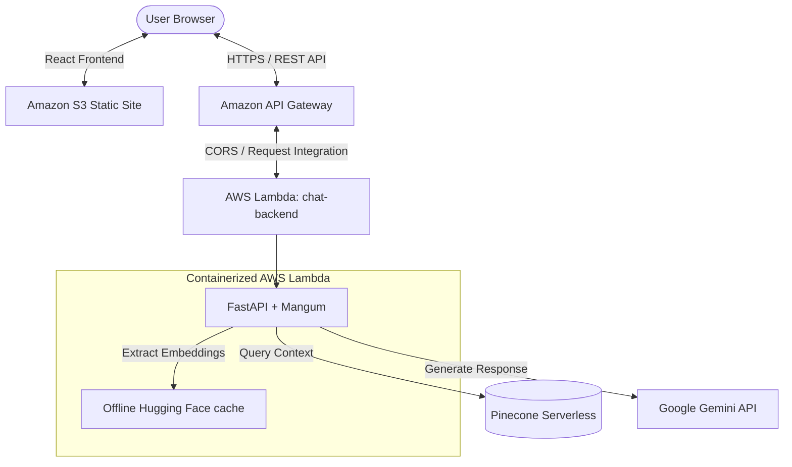

# Chat with Codebase

A professional, full-stack RAG (Retrieval-Augmented Generation) application that lets you ask natural language questions about a specific GitHub repository. 

This project features a high-performance, containerized Python backend migrated to **FastAPI**, hosted serverlessly on **AWS Lambda** via **Docker & ECR**, and a fast **React (Vite)** frontend hosted on **Amazon S3**.

---

## 🏗️ Architecture & Flow



---

## ✨ Features

*   **Conversational AI:** A responsive React-based chat interface built on Vite.
*   **Containerized FastAPI Backend:** Wrapped using `Mangum` to run serverlessly on AWS Lambda with minimal cold start latency.
*   **Pre-baked Embedding Cache:** Hugging Face embeddings (`nomic-ai/nomic-embed-text-v1`) are baked directly into the Docker image, enabling **100% offline local embeddings** and eliminating run-time downloading overhead.
*   **Deep Code Awareness:** Ingests and semantically splits codebases (by functions and classes) to supply pinpoint context to the LLM.
*   **Serverless Vector Database:** Integrates with Pinecone Serverless for instant, cost-effective vector search.
*   **State-of-the-Art LLM:** Powered by Google's `gemini-1.5-flash` via Google AI Studio for fast and intelligent responses.

---

## 🛠️ Tech Stack

### Frontend
*   **Framework:** React (Vite)
*   **Styling:** Vanilla CSS
*   **API Client:** Axios
*   **Hosting:** Amazon S3 (Static Website Hosting)

### Backend & RAG Pipeline
*   **API Framework:** FastAPI + Uvicorn
*   **Serverless Handler:** Mangum (for AWS Lambda compatibility)
*   **Embedding Model:** `nomic-ai/nomic-embed-text-v1` (cached locally)
*   **Vector DB:** Pinecone Serverless (Cloud)
*   **LLM:** Google Gemini (`gemini-1.5-flash`)
*   **Containerization:** Docker (`public.ecr.aws/lambda/python:3.12`)
*   **Hosting:** AWS Lambda + Amazon ECR + Amazon API Gateway

---

## 🚀 Getting Started (Local Development)

### Prerequisites

*   [Node.js](https://nodejs.org/en) (v16.0.0+)
*   [Python 3.10+](https://www.python.org/)
*   [Docker](https://www.docker.com/) (for building and testing containers)
*   **Pinecone API Key:** Get one from [Pinecone](https://www.pinecone.io/)
*   **Google API Key:** Get one from [Google AI Studio](https://aistudio.google.com/app/apikey)

---

### 1. Clone the Repository
```bash
git clone https://github.com/juliuscaezer/chat-with-codebase.git
cd chat-with-codebase
```

### 2. Configure Environment Variables
Create a `.env` file inside the `backend/` directory:
```env
PINECONE_API_KEY="YOUR_PINECONE_API_KEY"
GOOGLE_API_KEY="YOUR_GOOGLE_AI_KEY"
```

### 3. Setup & Ingest Codebase Data
Before running the server, load the target codebase data into your Pinecone vector database:

```bash
cd backend

# Create and activate virtual environment
python3 -m venv venv
source venv/bin/activate  # Windows: .\venv\Scripts\activate

# Install dependencies
pip install -r requirements.txt

# Run the ingestion script
python3 -m src.vector_store
```

### 4. Run the Development Servers

Open two terminals:

*   **Terminal 1 (Backend API):**
    ```bash
    cd backend
    source venv/bin/activate
    python3 src/chat.py
    # Runs on http://127.0.0.1:5001
    ```

*   **Terminal 2 (Frontend UI):**
    ```bash
    cd frontend
    npm install
    npm run dev
    # Open http://localhost:5173 in your browser
    ```

---

## 📦 Containerization & AWS Deployment

### 1. Deploy the Backend (Docker & AWS Lambda)
1.  **Build and Push Docker Image to ECR:**
    ```bash
    docker build -t chat-backend ./backend
    docker tag chat-backend:latest YOUR_ACCOUNT_ID.dkr.ecr.us-east-1.amazonaws.com/chat-backend:latest
    docker push YOUR_ACCOUNT_ID.dkr.ecr.us-east-1.amazonaws.com/chat-backend:latest
    ```
2.  **Configure AWS Lambda:**
    *   Create a Lambda function using your ECR container image.
    *   Increase **Ephemeral Storage** to `1024 MB` (under Configuration -> General Configuration).
    *   Add the following **Environment Variables**:
        *   `GOOGLE_API_KEY`, `PINECONE_API_KEY`
        *   `HF_HUB_OFFLINE=1`, `TRANSFORMERS_OFFLINE=1`, `HF_HOME=/var/task/hf_cache` (to run the embedded model offline).
3.  **Setup API Gateway:**
    *   Create an HTTP API in API Gateway routing to your Lambda function.
    *   Enable **CORS** in API Gateway to allow requests from your frontend:
        *   *Origins:* `*` (or your S3 URL)
        *   *Headers:* `*`
        *   *Methods:* `POST`, `OPTIONS`

### 2. Deploy the Frontend (Amazon S3)
1.  Set the API Gateway URL as `API_URL` in `frontend/src/App.jsx`.
2.  Build and deploy the static files to an S3 Bucket configured for static website hosting:
    ```bash
    cd frontend
    npm run build
    # Sync dist/ to your S3 bucket
    aws s3 sync dist/ s3://YOUR-S3-BUCKET-NAME --acl public-read
    ```
